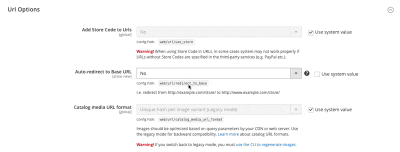
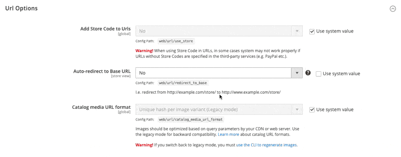

# Magento 2 Configuration Hints Module

A Magento 2 module that enhances the admin system configuration interface by displaying configuration paths and values across different scopes (default, website, store) with a copy button feature.

## Features

- Display configuration paths directly in the admin configuration panels
- Show configuration values from different scopes (default, websites, stores)
- Copy configuration paths with a single click
- Tooltip integration for better visibility

## Requirements

- Magento 2.4.4 or higher
- PHP 8.1 or higher

## Installation

### Via Composer

```bash
composer require hryvinskyi/magento2-configuration-hints
bin/magento module:enable Hryvinskyi_ConfigurationHints
bin/magento setup:upgrade
```

### Manual Installation

1. Create the following directory structure in your Magento installation:
   `app/code/Hryvinskyi/ConfigurationHints`
2. Download the module files and place them in this directory
3. Run the following commands:

```bash
bin/magento module:enable Hryvinskyi_ConfigurationHints
bin/magento setup:upgrade
```

## Usage

Once installed and enabled, the module automatically adds the following enhancements to your admin system configuration:

1. **Path Display**: Each configuration field shows its configuration path
2. **Scope Values**: Different values across websites and stores are displayed in tooltips
3. **Copy Button**: Each configuration path has a copy button to easily copy the path to clipboard

No additional configuration is required - the module works out of the box.

## Screenshots





## How It Works

The module injects additional information into the Magento 2 system configuration fields through plugins:

- Adds configuration path hints to field tooltips
- Displays values from different scopes (default, websites, stores)
- Implements copy button functionality through JavaScript

## Support

For issues, questions or contributions, please contact the author or create an issue in the GitHub repository.

## Author

- **Volodymyr Hryvinskyi**
- Email: volodymyr@hryvinskyi.com
- GitHub: https://github.com/hryvinskyi

## License

This project is licensed under the MIT License.